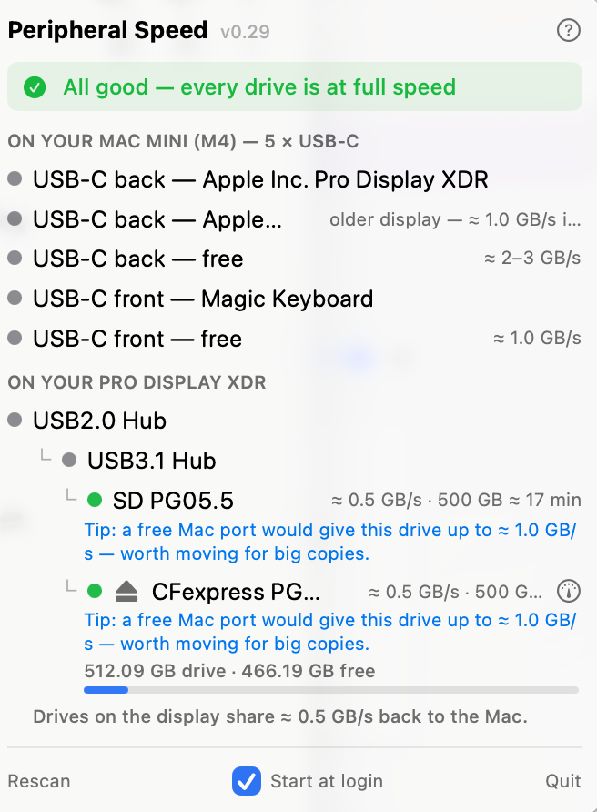

# Peripheral Speed ⚡

A Mac menu-bar app that answers one question: **how fast can data actually copy through this Mac's ports — and what's slowing it down?**

Marketing says "10Gbps". Reality is a drive silently stuck at USB-2 behind the wrong cable, the wrong hub, or the wrong hole. Peripheral Speed reads what every device *actually negotiated*, translates everything into one honest unit (real-world **GB/s**), and tells you what to fix.



It even coaches placement: a drive limited by the hub or display it's plugged into gets a tip naming the faster free Mac port it could use. No tip means you're already on the best port.

## What it shows

- **Your ports, laid out the way you see them on your desk** — the Mac's ports (front/back on M4 minis, left/right on the MacBook Neo, USB-A where present), then your display's ports. Free ports show what a drive plugged there would get.
- **Drives with real numbers** — negotiated copy speed plus an offload estimate ("≈ 1.0 GB/s · 500 GB ≈ 8 min") and a capacity line ("1 TB drive · 487 GB free", warns when nearly full). A ⏏ button ejects safely; a gauge button **measures true write/read speed** with a short uncached test file.
- **Live copy speed** — open the menu during a transfer and watch it in real time: "Copying right now ≈ 0.8 GB/s". Sampled only while the menu is open, so idle CPU stays ≈ 0.
- **Bottlenecks, with the fix** — a drive on a bad link goes red with specific advice ("move it to the left port — the right one is USB-2 only", "swap the cable for one marked 10Gbps/SS").
- **A port database of every Apple Silicon Mac** — including ports macOS can't see while empty (USB-A, the M4 mini's front pair) and asymmetric ones (the MacBook Neo's fast-left / slow-right).

Everything updates the instant you plug or unplug something (IOKit notifications — idle CPU ≈ 0%). Updates install themselves: when a new version is out, a one-click **update now** button downloads it, verifies the Developer ID signature, and relaunches.

## Install

1. Download the latest `PeripheralSpeed-x.y.zip` from [Releases](https://github.com/kurikurikun/peripheral-speed/releases), unzip, and drag **PeripheralSpeed.app** into Applications (choose *Replace* if updating).
2. Open it — the ⚡ appears in the menu bar. Releases from v0.17 are signed and notarized by Apple, so it opens first try. It starts at login automatically from then on (a checkbox in the footer turns that off).

Apple Silicon only (M1 and later).

## Build from source

No Xcode project needed — just Command Line Tools:

```bash
git clone https://github.com/kurikurikun/peripheral-speed.git
cd peripheral-speed
swift run
```

## Helping with unknown Macs

If the port list looks wrong on your Mac, click **? → Copy diagnostic info** in the app and open an issue with the result pasted in. That fingerprint (controller classes and device tree — no personal data) is exactly what's needed to add your model to the port database.

## License

MIT — see [LICENSE](LICENSE).

Made in Japan · Built with [Claude Code](https://claude.com/claude-code) · [www.move-ment.co](https://www.move-ment.co)
